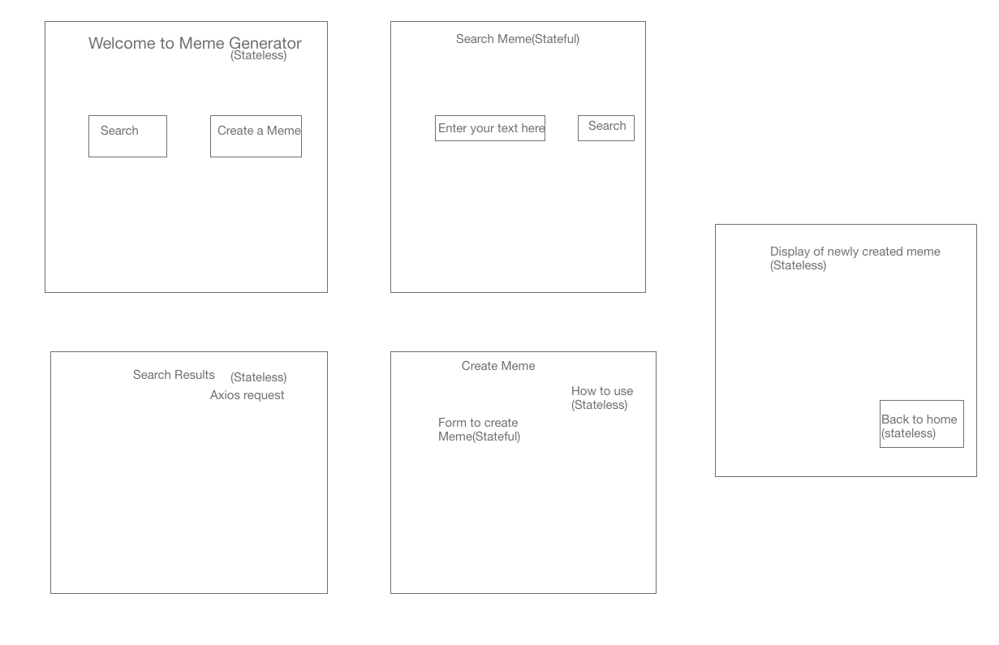

### meme_app
### API used:

Image flip API - https://api.imgflip.com/

### Problem Statement

An app that helps to view and create captions for memes

### Target Users

Anyone who loves to create meme 

### Wireframe

Stateful Components :
1. GenerateMemes.js -  http post 
2. Search.js - http get (to fetch memes)

Stateless:
1. Home.js
2. About.js
2. SearchResult.js
3. HowTo.js
4. MemeResult.js
5. MemeError.js

Reference:
1. Below video helped to learn about rendering React-App as multi-page app using React-Router
   https://www.youtube.com/watch?v=hjR-ZveXBpQ
2. Conditional Rendering with tenary operators
   https://scotch.io/tutorials/7-ways-to-implement-conditional-rendering-in-react-applications#toc-4-ternary-operators 

